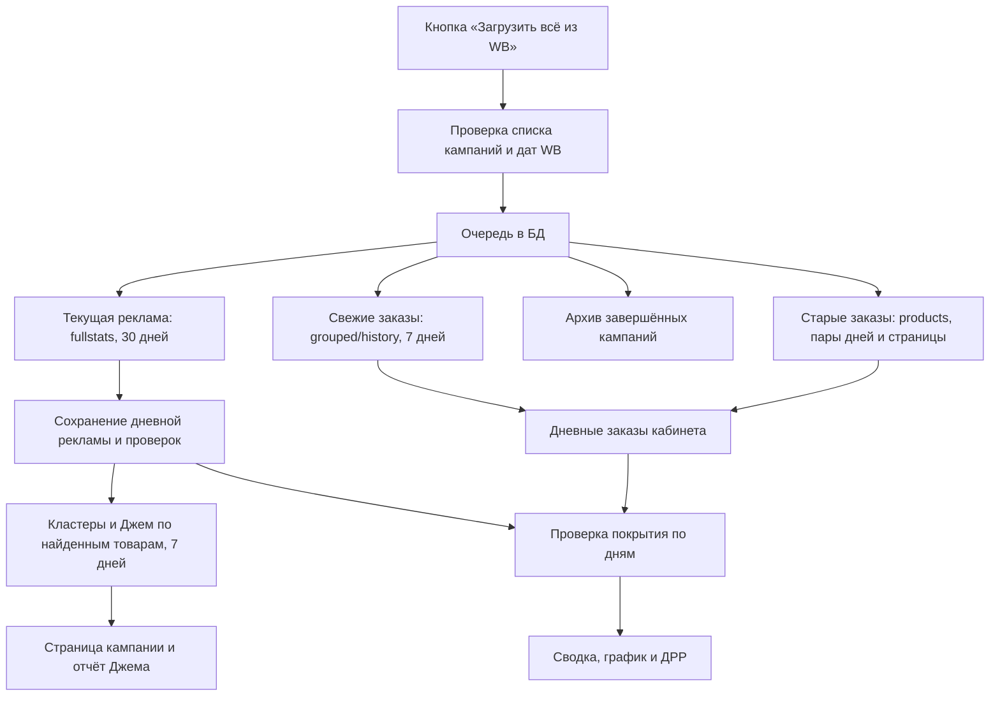

# Как EcomAds загружает данные Wildberries

Состояние реализации: 2 октября 2026 года. Документ описывает **работающий код**, а не желаемую схему. Лимиты WB могут измениться; перед изменением очереди их нужно сверять с документацией методов.

## Коротко для владельца кабинета

Кнопка «Загрузить всё из WB» сначала обновляет текущие рекламные кампании за **последние 30 завершённых дней по Москве** и все заказы за **последние 7 дней**. Как только появляются товары из рекламной статистики, ставятся кластеры и Джем за 7 дней. Проверка завершённых кампаний и дозагрузка старых заказов идут позже. Данные на открытых страницах появляются по мере импорта, без ожидания конца всей очереди.

Лимиты базового токена соблюдаются отдельно по методам. У небольшого кабинета свежая часть обычно укладывается в несколько минут при свободных слотах; каждые следующие 50 кампаний требуют ещё один час для рекламной статистики. Старые 23 дня заказов требуют минимум около 6 часов: их получают другим методом, по два дня за запрос. Время увеличится, если ответ содержит больше одной страницы товаров или WB попросит подождать.

## Поток данных

1. Сервер определяет вчерашний день в часовом поясе `Europe/Moscow`. Текущий день не входит в первоначальные 30 дней.
2. Список кампаний обновляется, если его последняя проверка старше часа и метод WB доступен по лимиту. Для планирования используются сохранённые кампании, если WB временно не ответил. Даты создания, запуска, удаления и обновления кампании сохраняются из WB отдельно от даты создания записи в EcomAds.
3. В таблицу заданий ставятся `fullstats` для активных и приостановленных кампаний, `funnel_recent` для свежих заказов, `archive` для завершённых кампаний и `funnel_backfill` для недостающих старых дней. Первую пачку рекламы до 50 кампаний дополняют архивными, если есть свободные места. Повторное нажатие использует активные задания того же вида.
4. Работник берёт готовое задание с приоритетом: **текущая реклама и свежие заказы → кластеры и Джем → архив и старая история**. Он резервирует слот метода в БД до HTTP-запроса. Ожидание одного метода не блокирует другой. Отправка запросов последовательная; работник проверяет очередь примерно раз в 15 секунд.
5. После каждой обработанной пачки рекламы EcomAds собирает пары «кампания–товар» для кластеров и товары для Джема. Одинаковые товары и пары в рамках запуска повторно не ставятся. Для этих отчётов не требуется ждать конца всего архива.
6. Импорт сохраняет данные в БД. Поля свежести и версии источников позволяют открытой сводке и странице кампании обновить только связанные запросы.

Основные таблицы: `wb_sync_jobs` и `wb_sync_job_events` — очередь и история; `wb_method_slots` — последний запрос метода; `campaign_statistics` и `campaign_nomenclature_statistics` — рекламные показатели; `wb_campaign_daily_checks` — подтверждённые дни расхода; `wb_store_daily_orders` — все заказы кабинета по дням; `wb_cluster_statistics` — кластеры; `wb_jam_search_queries` и `wb_jam_article_checks` — отчёты Джема и явные пустые ответы.

## Методы WB и границы запросов

| Источник | Метод WB | Лимит базового токена, принятый в EcomAds | Объём одного запроса | Как используется |
| --- | --- | --- | --- | --- |
| Список кампаний | `GET /api/advert/v2/adverts` | 1 запрос в час | Список кабинета | Метаданные и жизненный цикл кампаний |
| Рекламная статистика | `GET /adv/v3/fullstats` | 1 запрос в час | До 50 кампаний, до 31 дня | Текущая реклама и архив делят **один** слот |
| Поисковые кластеры | `POST /adv/v1/normquery/stats` | 2 запроса в час, интервал 30 минут | До 100 пар «кампания–товар», до 7 дней | Только по товарам, найденным в рекламе |
| Джем | `POST /api/v2/search-report/product/search-texts` | 1 запрос в час | До 50 товаров, до 7 дней | Отдельный сохранённый отчёт по периоду; требуется доступ к методу |
| Свежие все заказы | `POST /api/analytics/v3/sales-funnel/grouped/history` | 2 запроса в час, интервал 30 минут | Весь кабинет, дневные данные максимум за последнюю неделю | Последние 7 завершённых дней |
| Старые все заказы | `POST /api/analytics/v3/sales-funnel/products` | 2 запроса в час, интервал 30 минут | Два сравниваемых периода, до 1000 товаров на страницу; архив до 365 дней | В EcomAds периоды задаются по одному дню: текущий и предыдущий, чтобы получить два дня одним запросом |

WB задаёт лимиты на аккаунт продавца **по методу или группе методов**, а не один общий лимит для всех перечисленных запросов. EcomAds хранит слоты по подключённому кабинету (`storeId`), не определяет тип токена автоматически и использует интервалы базового токена даже для более быстрого токена. Если один аккаунт WB подключить в EcomAds дважды, локальные слоты разных подключений не координируются; окончательное ограничение в таком случае применит WB. Ответ `429` и заголовки `Retry-After` / `X-Ratelimit-Retry` сдвигают следующую попытку. Бронь слота фиксируется до запроса: после сбоя процесса возможна задержка, но не повторный расход того же слота в пределах одного подключения.

Официальные источники: [общие правила лимитов WB](https://dev.wildberries.ru/knowledge-base/articles/019d49a1-28ca-7735-bf2f-98210695abc7/limity-zaprosov-wb-api), [реклама и продвижение](https://dev.wildberries.ru/docs/openapi/promotion), [аналитика и воронка продаж](https://dev.wildberries.ru/docs/openapi/analytics). Числа в таблице также сверены с [OpenAPI YAML рекламы](https://dev.wildberries.ru/api/swagger/yaml/ru/08-promotion.yaml) и [OpenAPI YAML аналитики](https://dev.wildberries.ru/api/swagger/yaml/ru/11-analytics.yaml), на которых основана конфигурация текущего кода. Веб-страницы WB иногда отвечают `498` автоматическим клиентам.

## Почему 30 дней заказов загружаются долго

Дневной метод `grouped/history` WB разрешает только последнюю неделю. Для дней 8–30 EcomAds использует `products`: передаёт два соседних дня как сравниваемые периоды, суммирует товары по всем страницам ответа и сохраняет обе дневные суммы. Всего для 23 старых дней нужно около **12 запросов**, то есть минимум около **6 часов** при интервале 30 минут. Каждый запрос может иметь дополнительные страницы по 1000 товаров, и каждая страница расходует отдельный слот. Уже сохранённый свежий день фоновая дозагрузка не заменяет. Позиция страницы и промежуточные суммы хранятся в задании, чтобы продолжить после перезапуска.

Метод `products` WB допускает архив до 365 дней, но автоматическая первоначальная загрузка EcomAds ограничена последними 30 завершёнными днями. Для более старой истории нужна отдельная политика накопления или загрузки. Большая часть данных воронки появляется в течение часа, но небольшая часть может уточняться несколько дней; WB обновляет отчёт раз в час. Поэтому «загружено» означает полученный на указанное время снимок, а не неизменный окончательный итог.

## Что значит полнота данных и ДРР

У расхода различаются **полученное число**, **явно полученный ноль** и **неизвестное значение**. Ответ HTTP `200` или завершённое задание не доказывают, что WB вернул все запрошенные кампании и дни. Кампанию, отсутствующую в ответе `fullstats`, EcomAds запрашивает ещё один раз в рамках запуска; если ответ снова пустой, расход остаётся неизвестным. Обычная строка статистики без записи проверки также не подтверждает отсутствующие дни. Старая статистика не стирается при ошибке обновления.

Для каждого дня EcomAds проверяет, что известен расход всех кампаний, которые могли работать в этот день, и сумма всех заказов каждого подключённого кабинета. Дата создания кампании берётся из WB; если дата неизвестна, исключать её из старого периода нельзя. «Заказы» берутся из воронки **по всему кабинету**, включая нерекламные товары. Это не число заказов из рекламного `fullstats` и не сумма выкупов.

**Полный ДРР** = сумма подтверждённого рекламного расхода / сумма всех заказов за тот же выбранный период × 100. **Предварительный ДРР** использует только дни, в которых подтверждены обе стороны отношения по всем участвующим кабинетам; например, «по 5 из 7 дней». Дневные проценты не усредняются. Если подходящих дней нет или сумма заказов равна нулю, показывается «—» с причиной. На графике неподтверждённые дни остаются пропусками. Сравнение с прошлым периодом возможно только при полном покрытии обоих периодов.

Свежесть и полнота — разные свойства: старый проверенный период может быть полным, но устаревшим. Сводка и страница кампании показывают диапазон имеющихся подтверждений, время проверки, состояние очереди и следующий запрос. Пока вкладка видима и загрузка активна, состояние проверяется каждые 15 секунд; без активной загрузки — раз в минуту и при возвращении на вкладку.

## Джем и сообщение о пустых данных

Джем сохраняется как отчёт за конкретный период до 7 дней. Его период выбирается отдельно от общего фильтра сводки или кампании. По умолчанию открывается последний сохранённый отчёт, связанный с товарами кампании; старые отчёты можно выбрать вручную. Пересекающиеся недельные отчёты не складываются. В таблицу рекламных кластеров значения Джема попадают только при точном совпадении периодов.

Пустой успешный ответ Джема записывается **по каждому запрошенному товару**. Он отличается от отсутствия загрузки и от отказа WB из-за доступа или подписки. При новой загрузке предыдущий отчёт остаётся на экране, пока новый не завершён.

Сообщение «Часть запрошенных кампаний или товаров не вернула данных» сейчас общее для двух разных ситуаций: отсутствующей кампании в `fullstats` и товара без запросов в Джеме. Это **не означает само по себе ошибку всей загрузки**. Известный недостаток интерфейса: счётчик пустых ответов накопительный, поэтому предупреждение о кампании может остаться после успешной повторной проверки. Подробное состояние полноты расхода нужно смотреть отдельно от этого предупреждения.

## Краткая история решений этой сессии

1. **Одна кнопка вместо выбора дат и ID.** Для первоначальной рекламы взяли 30 завершённых дней; для кластеров и Джема — 7 дней. Ежедневный автозапуск оставили выключенным.
2. **Лимиты повышать не стали.** Вместо общего слота сделали слоты методов. Текущая реклама и архив делят `fullstats`; два метода воронки имеют отдельные слоты.
3. **Свежие данные получили приоритет.** Активные кампании и свежие заказы загружаются раньше большого архива. Кластеры и Джем стартуют по обработанным товарам, не дожидаясь последней архивной кампании.
4. **30 дней заказов получаем двумя путями.** Последняя неделя — дневной метод WB; более старые дни — постраничный отчёт по товарам. Ограничение 7 дней относится к первому методу, а не ко всей доступной истории WB.
5. **ДРР сделали проверяемым.** Неизвестный расход не превращается в ноль. Предварительное значение считается по одинаковым подтверждённым дням расхода и заказов; график и карточка используют серверную оценку.
6. **Свежесть показали на страницах.** Период, время проверки, частичность и ожидание лимита видны на сводке и кампании; открытые страницы обновляются после импорта.
7. **Джем отвязали от общего фильтра.** Добавили выбор сохранённого отчёта и отдельное состояние успешного пустого ответа. Обнаруженное позднее общее предупреждение о «кампаниях или товарах» остаётся неточным и описано выше.

## Где это реализовано

- Очередь и лимиты: [`WbSyncPlanner.cs`](../Ecomads.WebApplication/Services/Wb/WbSyncPlanner.cs), [`WbSyncWorker.cs`](../Ecomads.WebApplication/Services/Wb/WbSyncWorker.cs), [`WbRateLimits.cs`](../Ecomads.WebApplication/Services/Wb/WbRateLimits.cs).
- Клиенты WB: [`WbPromotionClient.cs`](../Ecomads.WebApplication/Services/Wb/WbPromotionClient.cs), [`WbSalesFunnelClient.cs`](../Ecomads.WebApplication/Services/Wb/WbSalesFunnelClient.cs), [`WbJamClient.cs`](../Ecomads.WebApplication/Services/Wb/WbJamClient.cs).
- Подтверждение и ДРР: [`WbDataCoverageService.cs`](../Ecomads.WebApplication/Services/Wb/WbDataCoverageService.cs), [`WbDataStateController.cs`](../Ecomads.WebApplication/Controllers/WbDataStateController.cs).
- Джем: [`WbJamImporter.cs`](../Ecomads.WebApplication/Services/Wb/WbJamImporter.cs), [`WbCampaignJamController.cs`](../Ecomads.WebApplication/Controllers/WbCampaignJamController.cs).
